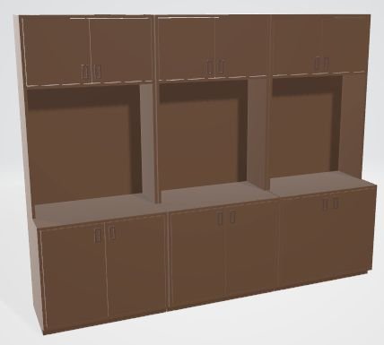

# Furniture designs that my father-in-law made

## Chest of Drawers

## Computer Table (made 3 tables)

## Sliding Door Cabinet for Platters

## Dining Room Wall Cabinet

## Upper and Lower parts of Wall Cabinet

## Double Chest of Drawers

## Family Room Case (3 make up wall unit)

## Family Room Table

## Family Room Table (with leaf inserted)

## Hinge Expanding Table

## Hinge Expanding Table (expanded)

## Secretary with Fold-Out Writing Surface

## Stationary Cabinet
