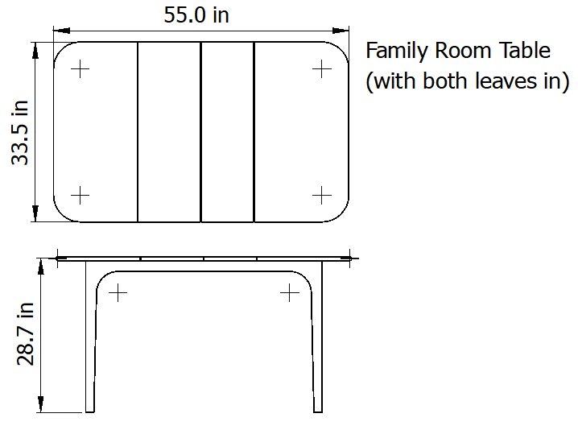

# Furniture designs that my father-in-law made

## Chest of Drawers

<table width="100%">
<tr>
<td width="50%">

</td>
<td>

</td>
</tr>
</table>

## Computer Table (made 3 tables)

<table width="100%">
<tr>
<td width="50%">

</td>
<td>

</td>
</tr>
</table>

## Sliding Door Cabinet for Platters

<table width="100%">
<tr>
<td width="50%">

</td>
<td>

</td>
</tr>
</table>

## Dining Room Wall Cabinet

## Upper and Lower parts of Wall Cabinet

<table width="100%">
<tr>
<td width="50%">

</td>
<td>

</td>
</tr>
</table>

<table width="100%">
<tr>
<td width="50%">

</td>
<td>

</td>
</tr>
</table>

## Double Chest of Drawers

<table width="100%">
<tr>
<td width="50%">

</td>
<td>

</td>
</tr>
</table>

## Family Room Case (3 make up wall unit)

<table width="100%">
<tr>
<td width="50%">

</td>
<td>

</td>
</tr>
</table>

<table width="100%">
<tr>
<td width="50%">

</td>
<td>

</td>
</tr>
</table>

## Family Room Table

<table width="100%">
<tr>
<td width="50%">

</td>
<td>

</td>
</tr>
</table>

## Family Room Table (with leaf inserted)

<table width="100%">
<tr>
<td width="50%">

</td>
<td>

</td>
</tr>
</table>

## Hinge Expanding Table

<table width="100%">
<tr>
<td width="50%">

</td>
<td>

</td>
</tr>
</table>

## Hinge Expanding Table (expanded)

<table width="100%">
<tr>
<td width="50%">

</td>
<td>

</td>
</tr>
</table>

## Secretary with Fold-Out Writing Surface

<table width="100%">
<tr>
<td width="50%">

</td>
<td>

</td>
</tr>
</table>

## Stationary Cabinet

<table width="100%">
<tr>
<td width="50%">

</td>
<td>

</td>
</tr>
</table>
